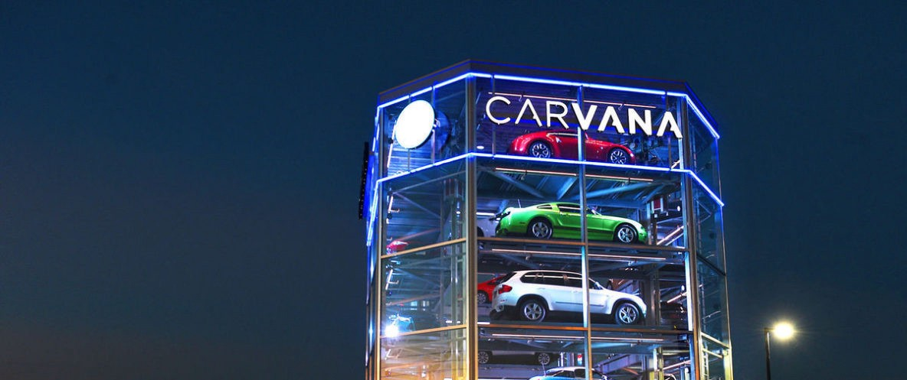

# Kaggle Carvana Image Masking Challenge

Code for the 1st place solution in [Carvana Image Masking Challenge on car segmentaion](https://www.kaggle.com/c/carvana-image-masking-challenge/leaderboard).

We used CNNs to segment a car in the image.
To achieve best results we use an ensemble of several differnet networks (Linknet, Unet-like CNN with custom encoder, several types of Unet-like CNNs with VGG11 encoder).

Our team:
- Artsiom Sanakoyeu ([linkedin](https://www.linkedin.com/in/sanakoev/))
- Alexander Buslaev ([linkedin](https://www.linkedin.com/in/al-buslaev/))
- Vladimir Iglovikov ([linkedin](https://www.linkedin.com/in/iglovikov/))

Blogpost explaining the solution: https://medium.com/kaggle-blog/carvana-image-masking-challenge-1st-place-winners-interview-78fcc5c887a8

# Requirements
To train final models you will need the following:

- OS: Ubuntu 16.04 
- Required hardware: 
    - Any decent modern computer with x86-64 CPU, 
    - 32 GB RAM
    - Powerful GPU: Nvidia Titan X (12Gb VRAM) or Nvidia GeForce GTX 1080 Ti. The more the better.

### Main software for training neural networks
- Cuda 8.0
- Python 2.7 and Python 3.5
- Pytorch 0.2.0

## Install
1. Install required OS and Python
2. Install packages with `pip install -r requirements.txt`
3. Set your paths in [congif/config.json](congif/config.json) :
- `input_data_dir`: path to the folder with input images (`train_hq`, `test_hq`), masks (`train_masks`) and `sample_submission.csv`
- `submissions_dir`: path to the folder which will be used to store predicted probability maps and submission files
- `models_dir`: path to the dir which will be used to store model snapshots. You should put downloaded model weights in this folder.
    
# Train all and predict all
If you want to train all the models and generate predicts:   
- Run `bash train_and_predict.sh`

# Train models
We have several separate neural networks in our solution which we then combine in a final ensemble.   
To train all the necessary networks:
- Run `bash train.sh`

After training finishes trained weights are saved in `model_dir` directory and can be used by prediction scripts. 
Or you can directly use downloaded weights and skip the training procedure.

**Required time:** *It may require quite a long time depending on hardware used. Takes about 30-60 min per epoch depending on the network on a single Titan X Pascal GPU. Total time needed is about 2140 hours, which is ~90 days on a single Titan X Pascal. The required time can be reduced if you use more GPUs in parallel.*

# Predict

- Run `bash predict.sh`

It may take considerable amount of time to generate all predictions as there are a lot of data in test and we need to generate prediction for every single model and then average them. Some of the models use test time augmentation for the best model performance. Each single model takes about 5 hours to predict on all test images on a single Titan X GPU.

When all predictions are done they will be merged in a single file for submit.  
File `ens_scratch2(1)_v1-final(1)_al27(1)_te27(1).csv.gz` that contains final predicted masks for all tst images will be saved in `submisions_dir`.

**Required time:** *It may require quite a long time depending on hardware used. Takes from 4 to 8 hours per model to generate predictions on a single Titan X Pascal GPU. Total time needed is about 320 hours, which is ~13 days on a single Titan X Pascal. The required time can be reduced if you use more GPUs in parallel.*

# Remarks
Please, keep in mind that this isn't a production ready code but a very specific solution for the particular competition created in short time frame and with a lot of other constrains (limited training data, scarce computing resources and a small number of attempts to check for improvements). 

Also, inherent stochasticity of neural networks training on many different levels (random initialization of weights, random augmentations and so on) makes it impossible to reproduce exact submission from scratch.
